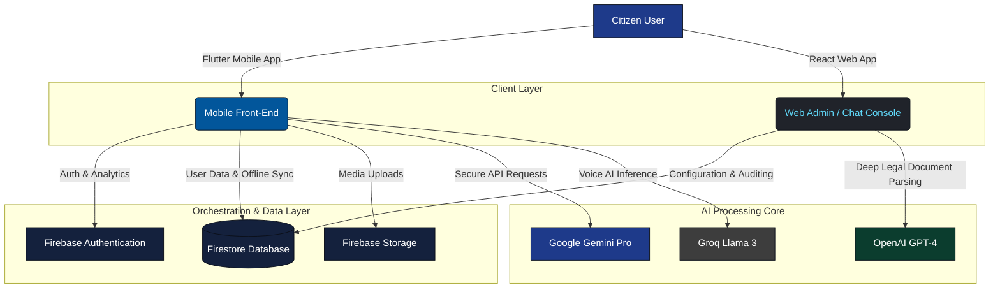
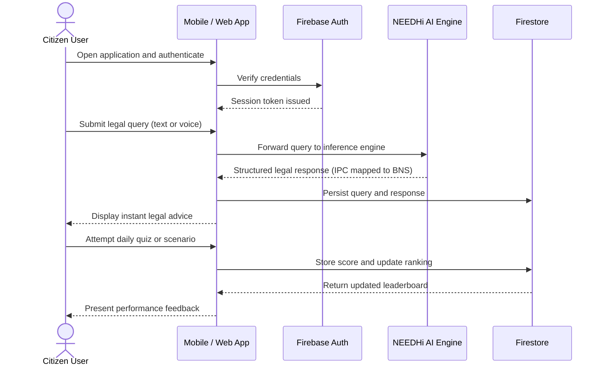

<div align="center">


<a href="https://github.com/SriramGandhiS/ROI-THE-LEGAL-APP">
  
</a>

<br/>

[](https://flutter.dev)
[](https://react.dev)
[](https://firebase.google.com)
[](https://groq.com)
[](LICENSE)


<br/><br/>

An enterprise-grade, multi-platform legal assistance ecosystem built with **Flutter (Mobile)** and **React (Web)**, engineered to democratize legal awareness and equip Indian citizens with constitutional and statutory knowledge through advanced artificial intelligence.

</div>

<br/>

<div align="center">

━━━━━━━━━━━━━━━━━━━━━━━━━━━━━━━━━━━━━━━━━━━━━━━━━━━━━━━━━━━━━━━━━━━━

</div>

## Table of Contents

- [Feature & Workflow Overview](#feature--workflow-overview)
- [System Architecture](#system-architecture)
- [User Query Workflow](#user-query-workflow)
- [Key Features](#key-features)
- [Technology Stack](#technology-stack)
- [Project Directory Structure](#project-directory-structure)
- [Security & Access Configuration](#security--access-configuration)
- [Installation & Setup](#installation--setup)
- [Core Development Team](#core-development-team)
- [License & Intellectual Property](#license--intellectual-property)

<div align="center">

━━━━━━━━━━━━━━━━━━━━━━━━━━━━━━━━━━━━━━━━━━━━━━━━━━━━━━━━━━━━━━━━━━━━

</div>

## Feature & Workflow Overview

| Module | Core Functionality | Status & Flow |
| :--- | :--- | :--- |
| **NEEDHi — AI Legal Tutor** | Real-time legal assistant for IPC and BNS sections | Active — User Query → Groq / Gemini Inference → Structured Advice |
| **Gamified Scenarios** | Legal scenario challenges with a points and ranking system | Active — Situation Simulation → Decision Logic → Score Calculation |
| **Legalytics Web Console** | Administrative dashboard for tracking user cases and queries | Active — React Dashboard → Firebase Realtime Sync → Audit Logs |
| **Multilingual Voice AI (VIDDHI)** | Voice-to-text legal query processing in regional languages | Active — Speech Input → Transcription Model → Translation → Response |

---

## System Architecture



---

## User Query Workflow



---

## Key Features

### NEEDHi — AI Legal Tutor
A structured AI chatbot designed to explain complex Indian constitutional law, criminal codes, and civic rights.
- **Multilingual support** — legal guidance dynamically translated and rendered in Hindi, Tamil, Telugu, Kannada, Bengali, and additional regional languages.

### VIDDHI — Voice AI Assistant
A hands-free, low-latency voice assistant that integrates browser and device microphones with real-time speech-to-text and AI legal reasoning to deliver instant verbal legal consultations.

### AI-Driven Daily Quiz
An interactive module that dynamically generates daily legal scenario challenges to assess a user's understanding of fundamental rights and constitutional provisions, with results tracked in Firebase.

### Statute Transformation (IPC to BNS)
A comparative analysis tool mapping sections of the legacy **Indian Penal Code (IPC)** directly to the newly enacted **Bharatiya Nyaya Sanhita (BNS)**, assisting both citizens and legal professionals through the transitional framework.

---

## Technology Stack

<div align="center">

| Layer | Technologies |
| :--- | :--- |
| **Mobile Framework** | Flutter (Dart), Bloc / Provider state management |
| **Web Console** | React.js, Tailwind CSS |
| **Backend & Database** | Firebase — Authentication, Firestore, Cloud Storage |
| **AI Models** | Groq Llama 3, Google Gemini Pro, OpenAI GPT-4 API |
| **Design System** | Plus Jakarta Sans and Inter typography, dark-mode-first interface |

</div>

---

---

## Security & Access Configuration

> [!IMPORTANT]
> **API Key Sanitization Notice.** All production API keys — Gemini, OpenAI, Groq, and Firebase credentials — have been removed from the public repository to mitigate security risk. To exercise the interactive AI features locally, configure your own configuration files with valid API tokens as outlined below.

---

## Installation & Setup

### Running the Flutter Mobile Application

```bash
# 1. Navigate to the mobile application directory
cd roi_app

# 2. Fetch project dependencies
flutter pub get

# 3. Add your google-services.json (from Firebase Console) to android/app/

# 4. Configure API keys in lib/consts.dart or lib/screens/ChatbotScreen.dart

# 5. Launch the application on a connected device or emulator
flutter run
```

### Running the React Web Dashboard

```bash
# 1. Navigate to the web project directory
cd legalytics-react

# 2. Install npm dependencies
npm install

# 3. Create a .env file in the project root
echo "REACT_APP_GROQ_API_KEY=your_groq_key_here" > .env

# 4. Start the development server
npm start
```

---

## Core Development Team

<div align="center">

Developed by **EAT AND LEARN TEAM**

| Avatar | Contributor | GitHub Handle | Role & Specialization | Profile |
| :---: | :--- | :--- | :--- | :---: |
|  | **Sriram S** | `@SriramGandhiS` | API Integration, Overall Development & Team Management | [Profile](https://github.com/SriramGandhiS) |
|  | **Solairajan** | `@Solairajan1509` | Full Stack Developer | [Fork](https://github.com/Solairajan1509/ROI-THE-LEGAL-APP) |
|  | **Vengata Visva** | Vengata Visva | Lead Mobile Engineer & Flutter Architecture | Team Member |
|  | **Suriya Kumar** | `@Suriyakumar4036` | Research & Development | [Fork](https://github.com/Suriyakumar4036/ROI-THE-LEGAL-APP) |
|  | **Sanjay Sekar** | `@sanjaysekar5` | Git Actions | [Fork](https://github.com/sanjaysekar5/ROI-THE-LEGAL-APP) |
|  | **Selvin Jef** | `@selvinjef123` | Quality Assurance / Tester | [Fork](https://github.com/selvinjef123/ROI-THE-LEGAL-AP) |
|  | **Red Eye Shu** | `@redeyeshu007` | Lead Solution Architect & Feature Specialist | [Fork](https://github.com/redeyeshu007/ROI-THE-LEGAL-APP) |
|  | **Rizz Architect** | `@rizz-architect` | CI/CD Pipeline & Automated Workflows | [Fork](https://github.com/rizz-architect/ROI-THE-LEGAL-APP) |

</div>

---

## License & Intellectual Property

**Hackathon Project** — all rights reserved by **EAT AND LEARN TEAM**.

This repository is published exclusively for educational review, architectural assessment, and portfolio evaluation. Unauthorized replication, redistribution, commercialization, or modification of this source code is strictly prohibited without consent from the **EAT AND LEARN TEAM**.

*Developed by **EAT AND LEARN TEAM**.*

<div align="center">


**EAT AND LEARN TEAM**

</div>
